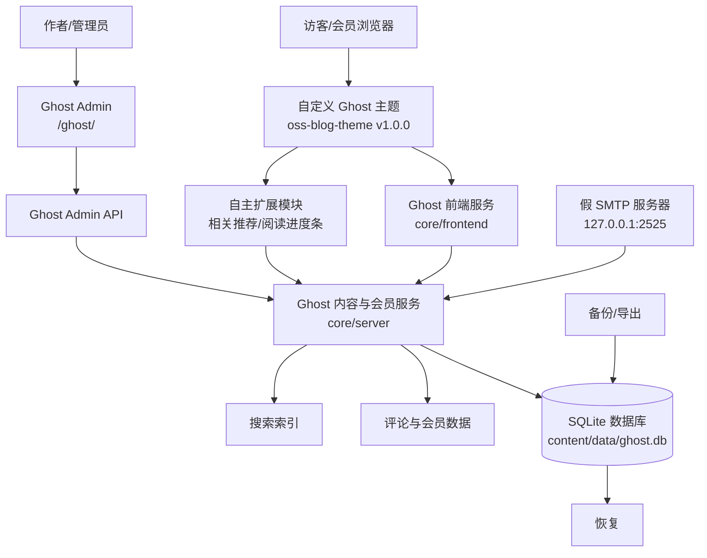

# 开源个人博客系统 - 基于 Ghost 二次开发

《开源软件与新技术》课程实验 01 项目

## 项目简介

本项目基于开源博客系统 [Ghost](https://ghost.org/) 进行二次开发，实现一个功能完整的个人博客系统。项目遵循"不修改 Ghost 核心"的原则，通过自定义主题和 Content API 进行功能扩展。

## 技术栈

- **博客平台**：Ghost 5.130.6
- **运行环境**：Node.js v22.23.2
- **数据库**：SQLite 3
- **主题引擎**：Handlebars (express-hbs)
- **前端**：HTML5 / CSS3 / JavaScript (jQuery)
- **版本管理**：Git 2.55.0

## 系统架构



**架构说明**：
- Ghost 核心负责认证、内容、标签、会员和评论，不修改核心代码
- 自定义主题和扩展模块是主要修改边界，通过主题助手或 Content API 访问内容
- 运行数据与源代码分离，数据库、日志和密钥不提交到 Git
- 本地假 SMTP 服务器接收邮件，解决开发环境邮件发送问题

## 项目结构

```
oss-blog/
├── docs/                    # 项目文档
│   ├── baseline.md          # 基线记录
│   ├── architecture.md      # 架构说明
│   └── ISSUES.md            # 自主扩展功能 Issue
├── theme/                   # 自定义主题源码
│   └── oss-blog-theme/      # 自定义主题
├── tests/                   # 测试文档
│   └── test-report.md       # 测试报告
├── backups/                 # 数据库备份
├── runtime/                 # Ghost 运行目录（不提交到 Git）
│   ├── content/             # 用户内容
│   │   ├── themes/          # 已安装主题
│   │   ├── data/            # 数据库文件
│   │   └── logs/            # 日志文件
│   ├── current/             # 当前 Ghost 版本（符号链接）
│   └── versions/            # Ghost 各版本
├── .gitignore               # Git 忽略配置
└── README.md                # 项目说明
```

## 功能特性

### 基础功能
- ✅ 文章发布与管理
- ✅ 标签分类
- ✅ 会员系统
- ✅ 评论功能
- ✅ 站内搜索
- ✅ 404 错误页面

### 自定义主题 (oss-blog-theme v1.0.0)
- ✅ 自定义导航栏（关于、归档）
- ✅ 自定义文章卡片样式
- ✅ 文章详情页元数据优化
- ✅ 自定义页脚（二次开发说明）
- ✅ 中文日期格式
- ✅ 响应式布局

### 自主扩展功能
1. **相关文章推荐** - 基于标签匹配，在文章详情页底部显示 3 篇相关文章
2. **阅读进度条** - 文章详情页顶部显示实时阅读进度

## 演示数据

- **文章**：8 篇（覆盖技术、生活、数据库等主题）
- **标签**：3 个（技术、生活、数据库）
- **会员**：2 个（张三、李四）

## 安装与运行

### 环境要求
- Node.js >= 18.0.0
- npm >= 8.0.0
- Git >= 2.0.0

### 安装步骤

1. **克隆项目**
```bash
git clone <repository-url>
cd oss-blog
```

2. **安装 Ghost**
```bash
cd runtime
# 手动安装 Ghost 5.130.6（详见 docs/baseline.md）
```

3. **初始化数据库**
```bash
cd runtime
knex-migrator init
```

4. **创建管理员账号**
```bash
# 通过 Ghost setup API 创建
# POST /ghost/api/v3/admin/authentication/setup/
```

5. **安装自定义主题**
```bash
# 将 theme/oss-blog-theme 复制到 runtime/content/themes/
# 通过管理端或数据库激活主题
```

6. **启动 Ghost**
```bash
cd runtime
$env:NODE_ENV="development"
node current/index.js
```

### 访问地址
- **前台**：http://localhost:2368/
- **管理端**：http://localhost:2368/ghost/

### 演示账号
- **管理员**：admin@example.com / 134679aaaa
- **会员**：zhangsan@example.com / lisi@example.com

## 数据库备份与恢复

### 备份
```bash
# 停止 Ghost 后复制数据库文件
Copy-Item runtime/content/data/ghost.db backups/ghost-$(date +%Y%m%d).db
```

### 恢复
```bash
# 停止 Ghost，用备份文件替换当前数据库
Copy-Item backups/ghost-20260906.db runtime/content/data/ghost.db
# 重启 Ghost
```

## 测试

共执行 18 项测试，全部通过：
- 功能测试：8 项
- 权限测试：4 项
- 界面测试：4 项
- 恢复测试：2 项

详见 [tests/test-report.md](tests/test-report.md)

## Git 版本管理

### 提交规范
- `feat:` 新功能
- `fix:` 修复问题
- `docs:` 文档更新
- `style:` 样式修改
- `refactor:` 重构
- `test:` 测试相关
- `chore:` 构建/工具相关

### 分支策略
- `main` - 主分支，稳定版本
- `develop` - 开发分支
- `feature/*` - 功能分支
- `fix/*` - 修复分支

## 上游仓库

- **上游参考**：https://github.com/L1nbd/Ghost （TryGhost/Ghost 的 fork）
- **许可证**：MIT

## 二次开发边界

本项目遵循"不修改 Ghost 核心"的原则：
- ✅ 允许修改：自定义主题、文档、测试、配置
- ❌ 禁止修改：Ghost 核心代码（runtime/current/core/）
- 扩展方式：主题模板、Content API、伴随服务

## 常见问题

### 1. Ghost 启动失败
检查端口 2368 是否被占用，数据库文件是否存在。

### 2. 主题不生效
确认主题已复制到 `runtime/content/themes/`，并通过数据库或管理端激活。

### 3. 数据库锁定
停止 Ghost 后再进行数据库操作。

## 许可证

本项目基于 Ghost (MIT License) 二次开发，自定义部分采用 MIT License。

## 作者

OSS Blog Developer - 《开源软件与新技术》课程实验
